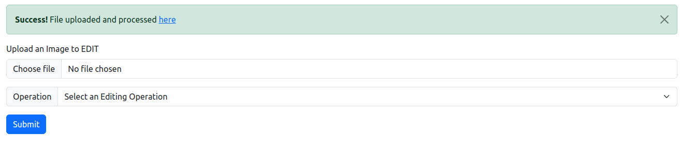

# Image Converter

Web Image Converter is a web-based tool for converting images from one format to another directly in your browser.

## Features

- Convert images between different formats such as JPEG, PNG, grayscale, ...
- Simple and intuitive user interface accessible from any modern web browser.
- Supports drag-and-drop functionality for easy uploading of images.
- Provides real-time conversion preview and download options.

## Web Interface


## Original JPG Image


## GrayScale


## Blur Image


## Canny Image


## Dilate Image


## Installation

Web Image Converter is a web application and does not require any installation. Simply access the application through a web browser.

## Usage

1. Open your web browser and navigate to the URL where the Web Image Converter is hosted.
2. Drag and drop your image files onto the web interface or click the upload button to select images from your computer.
3. Choose the desired output format for conversion.
4. Click the "Submit" button to initiate the conversion process.
5. Once the conversion is complete, download the converted images to your computer.

## Technologies Used

- HTML/CSS/JavaScript for the front-end interface.
- [Flask](https://flask.palletsprojects.com/) framework for the back-end server.
- [OpenCV](https://opencv.org/) library for image processing.

## Development

To set up the development environment:

1. Clone the repository:

    ```bash
    git clone https://github.com/manishk21/image_converter.git
    ```

2. Navigate to the project directory:

    ```bash
    cd image_editor
    ```

3. Install the required dependencies:

    ```bash
    pip install -r requirements.txt
    ```

4. Run the Flask server:

    ```bash
    python main.py
    ```

5. Access the application at `http://localhost:8000` in your web browser.

## Contributing

Contributions are welcome! Please fork the repository and submit a pull request with your changes.
