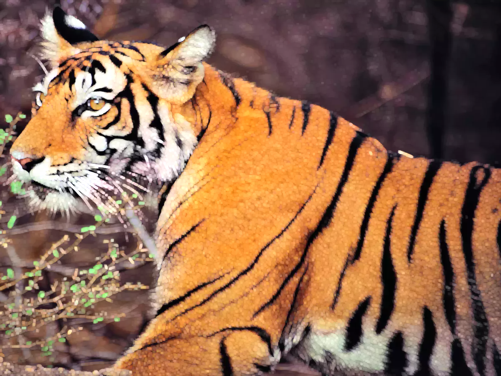

# Image Converter

Web Image Converter is a web-based tool for converting images from one format to another directly in your browser.

## Features

- Convert images between different formats such as JPEG, PNG, grayscale, ...
- Simple and intuitive user interface accessible from any modern web browser.
- Supports drag-and-drop functionality for easy uploading of images.
- Provides real-time conversion preview and download options.

## Web Interface


## Original JPG Image


## GrayScale


The "gray" operation likely refers to converting an image into grayscale. Grayscale images represent each pixel with a single intensity value, typically ranging from 0 (black) to 255 (white), without considering color information. This process simplifies image processing tasks and reduces memory usage compared to color images

## Blur Image


Used to reduce noise and detail in images. It works by averaging the pixel values within a neighborhood to create a smoother appearance. Gaussian blur, median blur, and mean blur are popular methods used for blurring images.

## Canny Image


Canny Edge Detection

1. Smoothing: Gaussian filter is applied to reduce noise and blur the image.

2. Gradient Calculation: Sobel filters compute gradient magnitude and direction, highlighting edges.

3. Non-maximum Suppression: Thin edges are retained by suppressing non-maximum pixels along gradient directions.

4. Double Thresholding: Pixels are classified as strong, weak, or non-edges based on predefined thresholds.

5. Edge Tracking: Weak edges adjacent to strong ones are connected, ensuring continuous edge contours.

Canny edge detection is a pivotal method in computer vision, adept at discerning edges amidst noise. Its systematic approach ensures robust edge detection, critical for tasks like object recognition and image analysis.

## Dilate Image


The dilate operation, a fundamental process in morphological image processing, enhances the size and shape of objects within a binary or grayscale image. It involves expanding the boundaries of foreground pixels by replacing each pixel with the maximum pixel value within its neighborhood defined by a structuring element. Dilation is commonly used for purposes like object detection, noise reduction, and image segmentation

## Installation

Web Image Converter is a web application and does not require any installation. Simply access the application through a web browser.

## Usage

1. Open your web browser and navigate to the URL where the Web Image Converter is hosted.
2. Drag and drop your image files onto the web interface or click the upload button to select images from your computer.
3. Choose the desired output format for conversion.
4. Click the "Submit" button to initiate the conversion process.
5. Once the conversion is complete, download the converted images to your computer.

## Technologies Used

- HTML/CSS/JavaScript for the front-end interface.
- [Flask](https://flask.palletsprojects.com/) framework for the back-end server.
- [OpenCV](https://opencv.org/) library for image processing.

## Development

To set up the development environment:

1. Clone the repository:

    ```bash
    git clone https://github.com/manishk21/image_converter.git
    ```

2. Navigate to the project directory:

    ```bash
    cd image_editor
    ```

3. Install the required dependencies:

    ```bash
    pip install -r requirements.txt
    ```

4. Run the Flask server:

    ```bash
    python main.py
    ```

5. Access the application at `http://localhost:8000` in your web browser.

## Contributing

Contributions are welcome! Please fork the repository and submit a pull request with your changes.
